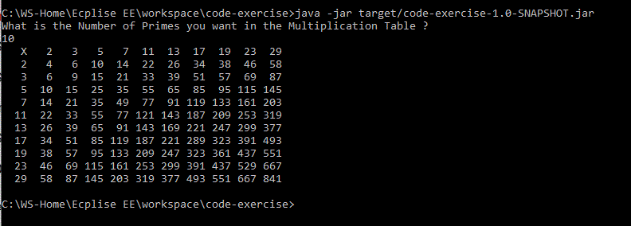

### CodeExercise - Prime Multiplication Table:

**Problem Statement:**
Print Multiplication table of the first 'N' prime numbers where 'N' is the +ve integer. The first Row and first Column of the table should have the first 'N' primes, each Cell in the table contains the cross product of the corresponding primes of the row and the column. 

The Below table is the programe print output of the first 10 primes, where first cell in the table contains 'X', represents the multiplication symbol.

   

 **Solution Description:**
 - Developed the Java 8 based project/program using eclipse and maven 3.6. This project has 2 classes. 
 - The main class has the 3 methods, 'main', primeList(int n), isPrime(int num) and printPrimeMltplcnTbl(List<Integer> primeList).
 The main method, prompt for the user input and user is expcted to enter a +ve integer as an input to generate the prime multiplication table.
 The primeList method takes this user entered input as param and generate the prime numbers while validating each number starting from 2 using the isPrime(num) and add to the list upto the desired number of primes.
 The printPrimeMltplcnTbl method takes this list as param, generate and print the table in the SysOut.

 - The other class is with the unit tests, it covers the primeList, isPrime and printPrimeMltplcnTbl methods for the unit testing.

- Maven Jar plugin is used to build the executable Jar artifact. This plugin generates the manifest of the main class.
 
**System Requrements and Dependencies : **
- Java 8 required as runtime environment, set the JAVA8_HOME environment variable and add that to the PATH.
- Java 8, Eclipse and Maven 3.6 are used as development environment. 
- Junit 4.12 used as unit test dependency in the pom.xml.
- Maven Jar and Maven compiler plugin used in the pom.xml.

**Installation and Usage:**
- clone the git repo into your local system with below command 
 git clone https://github.com/KesavChintada/code-exercise.git 
- The repos clone download the src, target folders and pom.xml, the target folder has the generated Jar file 'code-exercise-1.0-SNAPSHOT.jar', This Jar can be used to execute the programe without build/compile the jar in your local environment.

 - **Usage**: Make sure you have set the Java 8 environment in the path and execute the below command in the command prompt. This is an executable Jar, so you don't need to specify the Main class while executing the command as the Jar has the manifest of the main class.
 > C:\${yourdirectory}> java -jar ${pathoftheJar}/code-exercise-1.0-SNAPSHOT.jar
  this will prompt 
  'What is the Number of Primes you want in the Multiplication Table ?',  
  enter the +ve integer (ex: 10), the programe execute and print the table like the below 
    
   

-**Import the project into Eclipse and Build the project in your local:**
>Make sure you set the MAVEN_HOME and the JAVA8_HOME to the environment PATH and then go to the project directory where pom.xml is present, execute the below commands 
C:\${yourdirectory}\code-exercise>mvn eclipse:clean
C:\${yourdirectory}\code-exercise>mvn eclipse:eclipse

The above commands will generate the project mete-data to export the project into your eclipse environment.

C:\${yourdirectory}\code-exercise>mvn clean install 
The above command will compile the project, execute the Junit tests and build the artifact 'code-exercise-1.0-SNAPSHOT.jar' in the target folder.

you can go to eclipse and import the project using the import option 'Existing Maven Project'

**Limitations and Constrains:**
- Did not implemented the user input validations, so user is expected to enter the +ve integer.
- Used cell padding width of 4 digits/chars, the output format looks good upto 10 primes and little scattered the when number of primes increases.

